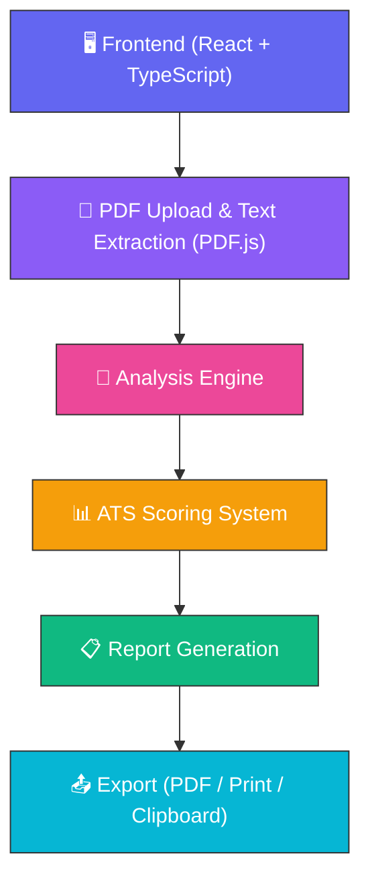

<div align="center">


# 🧠 ATS Resume Analyzer

### AI-Powered Resume Analysis & ATS Optimization Platform


**Upload. Analyze. Optimize. Get Hired.**

A premium, client-side ATS Resume Analyzer that scores your resume across 13 metrics, scans 9 resume sections, and delivers recruiter-grade feedback — all without your data ever leaving your browser.

[](https://github.com/Tejas-c-0/ATS-Resume-Analyzer/releases)
[](LICENSE)
[](https://github.com/Tejas-c-0/ATS-Resume-Analyzer/actions)
[](https://github.com/Tejas-c-0/ATS-Resume-Analyzer/stargazers)
[](https://github.com/Tejas-c-0/ATS-Resume-Analyzer/network/members)
[](https://github.com/Tejas-c-0/ATS-Resume-Analyzer/issues)
[](https://github.com/Tejas-c-0/ATS-Resume-Analyzer/commits/main)

<br/>

[](https://react.dev/)
[](https://www.typescriptlang.org/)
[](https://tailwindcss.com/)
[](https://vitejs.dev/)
[](https://www.framer.com/motion/)

<br/>

**Created by [Tejas C](https://github.com/Tejas-c-0)**

<br/>

[Live Demo](#-live-demo) • [Features](#-features) • [Installation](#-installation) • [Usage](#-usage) • [Architecture](#-project-architecture) • [Roadmap](#-roadmap) • [Contributing](#-contributing)

</div>

---

## 📑 Table of Contents

- [About the Project](#-about-the-project)
- [Features](#-features)
- [Live Demo](#-live-demo)
- [Screenshots](#-screenshots)
- [Demo](#-demo)
- [Technology Stack](#-technology-stack)
- [Folder Structure](#-folder-structure)
- [Installation](#-installation)
- [Environment Variables](#-environment-variables)
- [Usage](#-usage)
- [Project Architecture](#-project-architecture)
- [Analysis Workflow](#-analysis-workflow)
- [AI & Analysis Features](#-ai--analysis-features)
- [Privacy & Data Handling](#-privacy--data-handling)
- [Roadmap](#-roadmap)
- [Contributing](#-contributing)
- [License](#-license)
- [Support](#-support)
- [Acknowledgements](#-acknowledgements)

---

## 🎯 About the Project

**ATS Resume Analyzer** is a modern, fully client-side web application that helps job seekers understand exactly how their resume performs against real-world **Applicant Tracking Systems (ATS)** — the software recruiters use to filter candidates before a human ever sees a resume.

### Why this project exists

> Over 75% of resumes are rejected by ATS software before reaching a recruiter. Most candidates have no idea why.

This tool closes that gap by giving instant, structured, and honest feedback — without sending a single byte of personal data to a server.

### Key Highlights

| 🚀 | Highlight |
|---|---|
| 🔒 | **100% Client-Side** — your resume never leaves your browser |
| 📊 | **13 Scoring Metrics** — from ATS compatibility to recruiter impression |
| 📑 | **9-Section Breakdown** — strengths, weaknesses & suggestions per section |
| 💼 | **Job Role Matching** — see fit scores across 9 tech roles |
| 📤 | **One-Click PDF Export** — download a polished analysis report |
| 🌓 | **Dark / Light Mode** — fully responsive, glassmorphic UI |

---

## ✨ Features

<table>
<tr>
<td width="50%">

### 📄 Core Functionality
- ✅ Drag & drop **PDF Upload**
- ✅ Instant **ATS Analysis Engine**
- ✅ Real-time **Resume Preview**
- ✅ **Dark / Light Theme** toggle
- ✅ Fully **Responsive UI**

</td>
<td width="50%">

### 📊 Scoring & Reports
- ✅ Circular **Resume Score** (0–100)
- ✅ **13-Metric** detailed scoring
- ✅ **Job Match** across 9 roles
- ✅ Priority-tagged **Suggestions**
- ✅ Exportable **Final Report (PDF)**

</td>
</tr>
<tr>
<td width="50%">

### 🔍 Deep Analysis
- ✅ **Keyword Analysis** (missing/strong/weak/duplicate)
- ✅ **Skills Analysis** (languages, frameworks, cloud, DB)
- ✅ **Grammar & Spelling** detection
- ✅ **Formatting Compatibility** check

</td>
<td width="50%">

### 👥 Recruiter Insights
- ✅ **Recruiter Score** & first impression
- ✅ Readability & resume flow scoring
- ✅ Strongest / weakest section detection
- ✅ Interview & shortlist probability

</td>
</tr>
</table>

| Feature | Status |
|---|---|
| PDF Upload | ✅ Available |
| ATS Compatibility Analysis | ✅ Available |
| Grammar & Spelling Check | ✅ Available |
| Keyword Analysis | ✅ Available |
| Resume Score | ✅ Available |
| Recruiter Score | ✅ Available |
| Job Match | ✅ Available |
| Improvement Suggestions | ✅ Available |
| Export to PDF | ✅ Available |
| Dark Mode | ✅ Available |
| Responsive UI | ✅ Available |

---

## 🌐 Live Demo

<div align="center">

| Resource | Link |
|---|---|
| 🌍 **Website** | `<your-deployed-url-here>` |
| 📚 **Documentation** | `<your-docs-url-here>` |
| 🔌 **API** | _Not applicable — fully client-side_ |
| 🎥 **Demo Video** | `<your-demo-video-url-here>` |

</div>

> ⚠️ A live deployment link has not been published yet. Replace the placeholders above once you deploy (e.g. via Vercel, Netlify, or GitHub Pages).

---

## 🖼️ Screenshots

<div align="center">

| Upload Screen | Overview Dashboard |
|:---:|:---:|
|  |  |

| Detailed Scores | Skills Analysis |
|:---:|:---:|
|  |  |

| Final Report |
|:---:|
|  |

</div>

> 📌 Screenshots are stored in `assets/screenshots/`. Additional views (Keywords, Grammar, Formatting, Job Match tabs) can be added here as `keywords.png`, `grammar.png`, `formatting.png`, and `job-match.png`.

---

## 🎬 Demo

<div align="center">
  
</div>

```markdown
<!-- Embed syntax used above -->

```

> 📌 Record a short screen capture (upload → analysis → report) and save it as `assets/demo/demo.gif`.

---

## 🛠️ Technology Stack

<div align="center">

| Category | Technology |
|---|---|
| **Frontend Framework** |  |
| **Language** |  |
| **Styling** |  |
| **Build Tool** |  |
| **Animation** |  |
| **Icons** |  |
| **Charts** |  |
| **PDF Parsing** |  `pdfjs-dist` |
| **PDF Generation** |  + `@react-pdf/renderer` |
| **Screenshot Export** | `html2canvas` |
| **Utilities** | `clsx`, `tailwind-merge` |
| **Deployment** | Static hosting (Vercel / Netlify / GitHub Pages) |

</div>

> 💡 This is a **fully client-side application** — there is currently no backend, database, or external API dependency. All analysis runs locally in the browser.

---

## 📁 Folder Structure

```
ATS-Resume-Analyzer/
├── .gitignore                  # Git ignore rules (node_modules, dist, .vite, etc.)
├── README.md                   # Project documentation (this file)
├── SETUP.md                    # Step-by-step local setup instructions
├── GITHUB_UPLOAD_GUIDE.md      # Guide for pushing this project to GitHub
├── package.json                # Project metadata & dependencies
├── package-lock.json           # Locked dependency versions
├── index.html                  # HTML entry point
├── vite.config.ts              # Vite build configuration
├── tsconfig.json                # TypeScript compiler configuration
└── src/
    ├── App.tsx                 # Root application component
    ├── main.tsx                # React entry point (mounts App to DOM)
    ├── index.css                # Global styles & Tailwind directives
    └── utils/
        └── cn.ts                # Classname merge utility (clsx + tailwind-merge)
```

### Folder Reference

| Path | Purpose |
|---|---|
| `index.html` | The single HTML page that loads the React app |
| `src/main.tsx` | Bootstraps React and renders `<App />` into `#root` |
| `src/App.tsx` | Main application logic — upload, analysis, tabs, reports |
| `src/index.css` | Tailwind CSS imports and global style rules |
| `src/utils/cn.ts` | Merges conditional Tailwind class names safely |
| `vite.config.ts` | Configures React plugin, Tailwind plugin, path aliases (`@/`), and single-file bundling |
| `tsconfig.json` | Strict TypeScript rules and `@/*` path alias mapping |
| `.gitignore` | Excludes `node_modules`, `dist`, and Vite's `.vite` cache from version control |

---

## 📦 Installation

### Prerequisites
- **Node.js** `v18+`
- **npm** (comes with Node.js)

### 1️⃣ Clone the repository

```bash
git clone https://github.com/Tejas-c-0/ATS-Resume-Analyzer.git
cd ATS-Resume-Analyzer
```

### 2️⃣ Install dependencies

```bash
npm install
```

### 3️⃣ Run the development server

```bash
npm run dev
```

The app will be available at `http://localhost:5173` (default Vite port).

### 4️⃣ Build for production

```bash
npm run build
```

### 5️⃣ Preview the production build

```bash
npm run preview
```

### 6️⃣ Deploy

This project builds to a single static bundle (via `vite-plugin-singlefile`), making it deployable anywhere static files are served:

```bash
# Example: Deploy to Vercel
npm install -g vercel
vercel --prod

# Example: Deploy to Netlify
npm install -g netlify-cli
netlify deploy --prod --dir=dist
```

---

## 🔐 Environment Variables

This project currently runs **entirely client-side** with no required environment variables for core functionality.

If you extend the project with an AI API integration, create a `.env` file in the root using the template below:

**`.env.example`**
```env
OPENAI_API_KEY=
API_URL=
MODEL_NAME=
```

> ⚠️ Never commit your actual `.env` file. It is already excluded via `.gitignore`.

---

## 🚀 Usage

1. **Upload your Resume**
   Drag and drop a PDF file onto the upload zone, or click to browse your files.

2. **Automatic Analysis**
   The app extracts text from your PDF and runs it through the full analysis engine — no waiting on a server.

3. **Explore Your Results**
   Navigate through the tabs:
   `Overview → Details → Keywords → Skills → Grammar → Formatting → Job Match → Final Report`

4. **Review Your Score**
   View your overall ATS score, 13 detailed metrics, and section-by-section breakdown with strengths, weaknesses, and suggestions.

5. **Export Your Report**
   Download a polished PDF report, print it directly, or copy results to your clipboard.

> 📌 **Note:** Only text-based PDF files are supported. Scanned image-based resumes may not extract correctly.

---

## 🏗️ Project Architecture



---

## 🔄 Analysis Workflow

```mermaid
flowchart LR
    A[📤 Upload PDF] --> B[📝 Extract Text]
    B --> C[✏️ Grammar Check]
    C --> D[🔍 Keyword Analysis]
    D --> E[📊 ATS Scoring]
    E --> F[💡 Suggestions]
    F --> G[📋 Final Report]

    style A fill:#3b82f6,color:#fff
    style B fill:#6366f1,color:#fff
    style C fill:#8b5cf6,color:#fff
    style D fill:#ec4899,color:#fff
    style E fill:#f59e0b,color:#fff
    style F fill:#10b981,color:#fff
    style G fill:#06b6d4,color:#fff
```



---

## 🤖 AI & Analysis Features

<details>
<summary><b>✏️ Grammar & Spelling</b></summary>
<br/>

- Grammar mistake detection
- Spelling error identification
- Incorrect punctuation flags
- Weak action verb detection
- Passive voice identification
- Repeated word detection
- Capitalization issue checks

</details>

<details>
<summary><b>🔍 Keyword Analysis</b></summary>
<br/>

- Missing keywords vs. job requirements
- Strong keyword identification
- Weak / underused keywords
- Duplicate keyword detection
- Technical & ATS-specific keyword scanning

</details>

<details>
<summary><b>📊 Resume Score</b></summary>
<br/>

- Composite score from 13 weighted metrics
- Color-coded scoring (🟢 Green / 🟡 Amber / 🔴 Red)
- Section-level scoring breakdown

</details>

<details>
<summary><b>📐 Formatting Analysis</b></summary>
<br/>

- ATS compatibility checks (tables, icons, images, columns)
- Font, color, and hyperlink detection
- Margin and white space evaluation
- Section title validation

</details>

<details>
<summary><b>👥 Recruiter Analysis</b></summary>
<br/>

- Readability and first-impression scoring
- Strongest / weakest section detection
- Resume length and flow assessment

</details>

<details>
<summary><b>💼 Job Match Analysis</b></summary>
<br/>

Estimates suitability across:
Software Engineer · AI Engineer · ML Engineer · Data Scientist · Data Analyst · Full Stack Developer · Backend Developer · Frontend Developer · DevOps Engineer

</details>

---

## 🔒 Privacy & Data Handling

- ✅ All processing happens **entirely client-side** in your browser
- ✅ **No data is ever sent** to an external server
- ✅ Resume content **never leaves your device**
- ✅ No information is invented — analysis is based solely on the content you upload
- ✅ No resume rewriting — the tool **suggests**, it doesn't rewrite for you

---

## 🗺️ Roadmap

- [x] PDF upload & text extraction
- [x] ATS scoring engine (13 metrics)
- [x] Section-by-section analysis
- [x] Keyword & skills analysis
- [x] Grammar & spelling detection
- [x] Job match scoring
- [x] PDF export & print support
- [x] Dark / light theme
- [ ] Multi-resume comparison
- [ ] Resume template suggestions
- [ ] Browser extension version
- [ ] Multi-language resume support
- [ ] AI-powered rewrite suggestions (opt-in)

---

## 🤝 Contributing

Contributions are what make the open-source community such an amazing place to learn and create. Any contributions are **greatly appreciated**.

1. **Fork** the repository
2. **Create** your feature branch
   ```bash
   git checkout -b feature/AmazingFeature
   ```
3. **Commit** your changes
   ```bash
   git commit -m "Add some AmazingFeature"
   ```
4. **Push** to the branch
   ```bash
   git push origin feature/AmazingFeature
   ```
5. **Open** a Pull Request

Please make sure your code follows the existing TypeScript and Tailwind conventions before submitting.

---

## 📄 License

This project is licensed under the **MIT License**.
See the [LICENSE](LICENSE) file for full details.

---

## 💬 Support

- 🐛 **Bug Reports / Feature Requests:** [Open an Issue](https://github.com/Tejas-c-0/ATS-Resume-Analyzer/issues)
- 📧 **Email:** `<your-email-here>`

---

## 🙏 Acknowledgements

- [React](https://react.dev/) — UI library
- [Vite](https://vitejs.dev/) — Build tooling
- [Tailwind CSS](https://tailwindcss.com/) — Styling framework
- [Framer Motion](https://www.framer.com/motion/) — Animation library
- [PDF.js](https://mozilla.github.io/pdf.js/) — PDF text extraction
- [jsPDF](https://github.com/parallax/jsPDF) & [@react-pdf/renderer](https://react-pdf.org/) — PDF report generation
- [Recharts](https://recharts.org/) — Data visualization
- [Lucide](https://lucide.dev/) — Icon set
- [Shields.io](https://shields.io/) — README badges

---

<div align="center">

### ⭐ If this project helped you, consider giving it a star!

**Built with ❤️ by [Tejas C](https://github.com/Tejas-c-0)**

</div>
